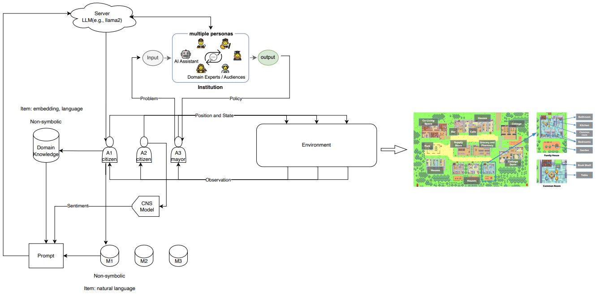

# Generalized LLM based Social Simulation Instrument 

this is xmt branch!

<!-- <p align="center" width="100%">

</p> -->

<p align="center" width="100%">

</p>

This repository is originated from [GA](https://github.com/joonspk-research/generative_agents) but covers it. Our simulation instrument is easily scalable and contains offline simulation module (GA) and online simulation module. Besides, we are developing UI (launch, display and interact) for user-friendliness.

## 环境
### 前端环境安装
#### 安装nodejs
- Linux
```bash
# 添加源
curl -sL https://deb.nodesource.com/setup_21.x | sudo -E bash -
# 安装nodejs
sudo apt-get install -y nodejs
sudo apt-get install -y npm
```
#### 安装依赖
进入到前端目录:
```bash
cd dai_agent_fronted
```
执行以下命令：
```bash
npm install
```

## 修改端口
将config.yaml中的port1、port2、port3修改为空闲的端口。
```yaml
server_ip: 10.72.74.13
front_port: port1
front_port2: port2
back_port: port3
```

## 启动
```bash
bash start.sh
```
如果有问题，请检查dai_agent_fronted/stdout.log、environment/frontend_server/stdout.log、reverie/backend_server/stdout.log查看是否端口冲突。

## 关闭
```bash
bash shutdown.sh
```


## Acknowledgements

The source code is adapted from [GA](https://github.com/joonspk-research/generative_agents).
